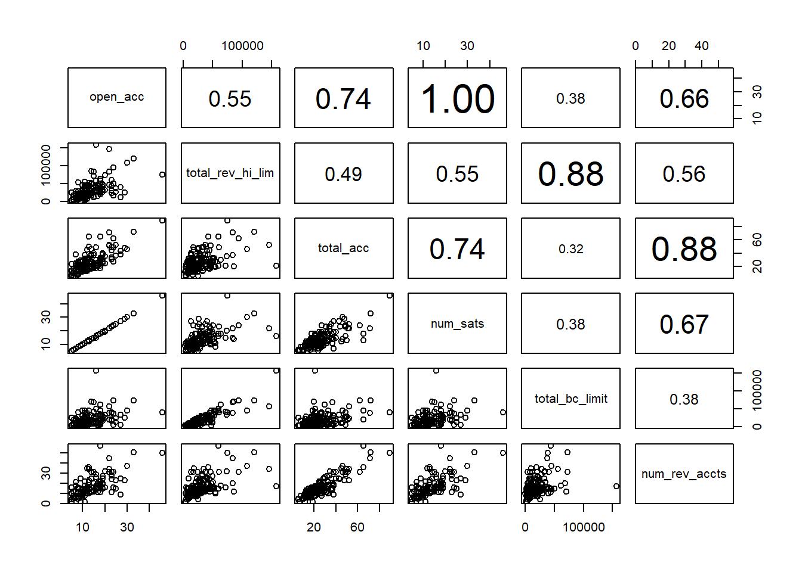

# Big data and data cleaning {#clean}


For this chapter we will use the file credit_semioriginal.xlsx, which has historical information of lendingclub, https://www.lendingclub.com/ fintech marketplace bank at scale. The original data set has at least 2 million observations and 150 variables. You will find the credit_semioriginal.xlsx with the first 1,000 observations and the 150 variables. using the 2 million rows sample would make our processor very low, but I challenge you to try the original data set to see what big data is. 

dataset source:
https://www.kaggle.com/wordsforthewise/lending-club


```r
library(openxlsx)
data<-read.xlsx("data/credit_semioriginal.xlsx")
```

Review the data structure of the credit dataset and descriptive statistics, only of the first 10 columns. 

```r
str(data[,1:10])
#> 'data.frame':	1000 obs. of  10 variables:
#>  $ loan_amnt      : num  3600 24700 20000 35000 10400 ...
#>  $ funded_amnt    : num  3600 24700 20000 35000 10400 ...
#>  $ funded_amnt_inv: num  3600 24700 20000 35000 10400 ...
#>  $ term           : chr  "36 months" "36 months" "60 months" "60 months" ...
#>  $ int_rate       : num  14 12 10.8 14.8 22.4 ...
#>  $ installment    : num  123 820 433 830 290 ...
#>  $ grade          : chr  "C" "C" "B" "C" ...
#>  $ sub_grade      : chr  "C4" "C1" "B4" "C5" ...
#>  $ emp_title      : chr  "leadman" "Engineer" "truck driver" "Information Systems Officer" ...
#>  $ emp_length     : chr  "10+ years" "10+ years" "10+ years" "10+ years" ...
```
We could see that there are some numerical columns and some categorical. For categorical I mean that its elements are characters.

## Categorical into numerical: filtering and coditionals

There are several reasons to transform a numerical column or variable into categorical.  For a detailed explanation I suggest to review the chapter "Handling Text and Categorical Attributes" of the book "Machine learning introductory guide in R". For the moment that some functions we will use in this chapter will not work if the variables are categorical. 

If you see the "loan_status" variable is categorical. First we review how many categories does the column loan_status has:

data[,col][!duplicated(data[,"col"])]

where data is the name of the dataframe and col is the column name 

```r
col<-"loan_status"
data[,col][!duplicated(data[,col])]
#> [1] "Fully Paid"         "Current"            "Charged Off"       
#> [4] "In Grace Period"    "Late (31-120 days)"
```

```
#> [1] 5
```

There are 5 categories, but we going to transform the column verification_status into numeric:

Create a filter, in such a way that the loan_status contains only Fully Paid and Charged Off.

data %>%
  filter(col== "categ1" |col== "categ2")

```r
library(dplyr)

data1<-data %>%
  filter(col== "Fully Paid" |loan_status== "Charged Off")
```


```
#> [1] 145
```

As a result, now we only have 145 rows. 


Besides "loan_status" three are several categorical columns, for example term, winch has 2 categories:

```r
col<-"term"
cat<-data[,col][!duplicated(data[,col])]
cat
#> [1] "36 months" "60 months"
```
The method we use to transform is simple, in this example "36 months" will take the value of one and "60 months" the value of 2. If the column would have 3 categories, the 3rd categories would take value 3 and so on. 


```r

ncat<-c(1:length(cat))
ncat
#> [1] 1 2
```

```r
cat[1]
#> [1] "36 months"
```


```r
col_cat<-ifelse(data1[, col] == cat[1],ncat[1],data1[, col])
head(col_cat)
#> [1] "60 months" "1"         "1"         "60 months" "60 months" "60 months"
```


```r
col_cat<-ifelse(data1[, col] == cat[1],ncat[1],ncat[2])
col_cat
#>   [1] 2 1 1 2 2 2 2 2 2 2 2 2 2 1 1 2 1 1 2 2 1 2 1 1 1 1 1 1 1 1 2 2 2 2 1 1 2
#>  [38] 1 2 2 2 1 1 2 2 1 2 2 1 1 1 1 2 1 1 2 1 1 1 1 2 2 2 1 2 2 2 1 1 2 2 1 2 1
#>  [75] 1 1 1 1 2 1 2 1 2 2 1 1 1 1 2 2 2 1 1 1 2 1 1 1 1 1 1 1 1 1 1 2 2 1 2 1 1
#> [112] 1 2 2 1 2 2 1 1 1 1 2 2 1 2 1 2 2 2 1 1 2 1 1 2 1 1 1 2 1 2 1 2 1 1
```

The former example was easy because we only have 3 categories, however, there are other 


I writted a library for data processing, "dataclean" To install it run the following code in a chunk:

remotes::install_github("abernal30/dataclean")
devtools::install_github("abernal30/dataclean")

We use the charname function to see how many categorical variables there are. We print only the first rows using the head function.


```r
data1[1,"mths_since_recent_bc"]*2
#> [1] 18
```


```r
library(dataclean)
charname(data1)
#>  [1] "term"                      "grade"                    
#>  [3] "sub_grade"                 "emp_title"                
#>  [5] "emp_length"                "home_ownership"           
#>  [7] "verification_status"       "issue_d"                  
#>  [9] "loan_status"               "purpose"                  
#> [11] "title"                     "zip_code"                 
#> [13] "addr_state"                "earliest_cr_line"         
#> [15] "initial_list_status"       "last_pymnt_d"             
#> [17] "next_pymnt_d"              "last_credit_pull_d"       
#> [19] "application_type"          "verification_status_joint"
#> [21] "hardship_flag"             "hardship_type"            
#> [23] "hardship_reason"           "hardship_status"          
#> [25] "hardship_start_date"       "hardship_end_date"        
#> [27] "payment_plan_start_date"   "hardship_loan_status"     
#> [29] "disbursement_method"       "debt_settlement_flag"     
#> [31] "debt_settlement_flag_date" "settlement_status"        
#> [33] "settlement_date"
```


```
#> [1] 33
```

There are 33 categorical columns. The function "tonum" transform a categorical column into numeric, for example transforming column "grade", it has the following categories:

```r
col<-"grade"
cat<-data[,col][!duplicated(data[,col])]
cat
#> [1] "C" "B" "F" "A" "E" "D" "G"
```

We need to specify the data source and the column name.

```r
col_cat2<-tonum(data1,col)
head(col_cat2)
#> [1] 1 2 2 3 2 4
```


Finally, if we are sure that we want to transform all the data set into numerical, the function "asnum" reviews detect the categorical columns and transform it into numeric, and as a result we would get a data frame. If we apply the function and review now winch are categorical columns, we do not get any.  

```r
data2<-asnum(data1)
head(charname(data2))
#> NULL
```


## Missing values


Lets apply the function "sumna" to detect columns with more than 50 percent of missing values: 


```r
sumna<- function(x,p) {
dim<-dim(x)
prov<-c()
co<-c()
for (i in 1:dim[2]){
su<-sum(is.na(x[,i]))/dim[1]
prov<-c(prov,su)
ind<-c()
co<-c(co,colnames(x[,i]))
}
me<-data.frame(prov)
rownames(me)<-colnames(x)
dim<-dim(me)
se<-c(1:dim[1])
me<-cbind(me,se)
cole<-c()
colem<-c()
cole_name<-c()
for (i in 1:dim[1]){ 
  if (me[i,1] > p) {
  cole<-c(cole,me[i,1])  
  colem<-c(colem,me[i,2])
  cole_name<-c(cole_name,rownames(me)[i])
  }
}
col2<-data.frame(cole)
col2<-cbind(col2,colem)
rownames(col2)<-cole_name
colnames(col2)<-c("% of NA´s","Column number")
col2
}
na_perc<-sumna(data2,.5)
head(na_perc)
#>                             % of NA´s Column number
#> mths_since_last_record      0.7448276            27
#> next_pymnt_d                1.0000000            45
#> mths_since_last_major_derog 0.6275862            50
#> annual_inc_joint            0.9931034            53
#> dti_joint                   0.9931034            54
#> mths_since_recent_bc_dlq    0.7103448            86
```


```
#> [1] 30  2
```

In this case there are  30 columns with more than 50 percent of missing values. if we sould like to eliminate those colums we apply the following:


```r
data3<-data2[,-na_perc[,2]]
```

To replace missing values or Na´s by some statistic, we us the function "repnas":


```r
repnas<-function(data,metric){
dim<-dim(data)
for (i in 1:dim[2]){data[,i][is.na(data[,i])]<-
  if(metric=="median"){
  median(data[,i],na.rm = TRUE)} else{
     if(metric=="mean"){
  mean(data[,i],na.rm = TRUE)}
    
  } 
}
data
}
data3<-repnas(data3,"median")
```


## Zero- and Near Zero-Variance Predictors

We wil use the library [@R-caret] for this section. Zero- and Near Zero-Variance Predictors  are variables or columns that only have a single unique value, winch is refereed as a “zero-variance predictor”. Also, the variables might have only a a few unique values that occur with very low frequencies. In both cases it may cause troubles when estimating an econometric or machine learning model. 

The function nearZeroVar shows the columns number of the Zero- and Near Zero-Variance Predictors. 


```r
library(caret)
nzv <- nearZeroVar(data3,saveMetrics= TRUE)
head(nzv)
#>                 freqRatio percentUnique zeroVar   nzv
#> loan_amnt        1.444444      49.65517   FALSE FALSE
#> funded_amnt      1.444444      49.65517   FALSE FALSE
#> funded_amnt_inv  1.444444      49.65517   FALSE FALSE
#> term             1.265625       1.37931   FALSE FALSE
#> int_rate         1.076923      19.31034   FALSE FALSE
#> installment      1.500000      93.79310   FALSE FALSE
```

```r
tail(nzv)
#>                           freqRatio percentUnique zeroVar   nzv
#> hardship_loan_status      71.500000     1.3793103   FALSE  TRUE
#> disbursement_method        0.000000     0.6896552    TRUE  TRUE
#> debt_settlement_flag       5.590909     1.3793103   FALSE FALSE
#> debt_settlement_flag_date 24.800000     8.2758621   FALSE  TRUE
#> settlement_status         11.818182     2.0689655   FALSE FALSE
#> settlement_date           41.333333    10.3448276   FALSE FALSE
```


To understand better what the "nearZeroVar" function is doing, lets estimate the metrics for the settlement_date  columns, first we apply the function "table", which gives the frequency per category:


```r
t<-table(data3[,col])
t
#> 
#>   1   2   3   4   5   6   7   8   9  10  11  12  13  14  15 
#> 124   2   2   2   3   1   1   1   1   2   1   1   1   2   1
```


There are 124 rows  with label 1, there are 2 rows  with label 2 and so on. 


The "frequency ratio" is the frequency of the most prevalent value over the second most frequent value. It  would be near one for well-behaved predictors and very large for highly-unbalanced, for the "grade" column it would be:

To estimate the "frequency ratio" e apply the "which.max" function that gives the position of the frequency of the most prevalent value:

```r
w <- which.max(t)
w
#> 1 
#> 1
```
To get the most frequent value:

```r
t[w]
#>   1 
#> 124
```

The second most frequent value would be


```r
max(t[-w])
#> [1] 3
```
Then, the "frequency ratio" is:

```r
t[w]/max(t[-w])
#>        1 
#> 41.33333
```

By default, it has a threshold of 19 (or 95/5), which in terms of our object "nzv" would show only those column for which the "frequency ratio" are higher than 19.


Also, the nearZeroVar  function shows the "percent of unique values", which is the number of unique values divided by the total number of rows of the data frame (times 100). It approaches zero as the granularity of the data increases.

The percent unique is the number of categories, which in the case of  the 124 column is estimated applying first the function "length":


```r
length(table(data3[,col])) 
#> [1] 15
```
between the number of rows of the data frame, which we obtain applying the fucntio "dim":


```r
dim(data3)[1]
#> [1] 145
```


Then the "percent of unique values" is:

```r
(length(table(data3[,col]))/dim(data3)[1])*100
#> [1] 10.34483
```

The object "nzv" shows the "frequency ratio" and the "percent of unique values", however, to apply the filter and get only those columns with a "frequency ratio" and "percent of unique values" higher than the respective threshold we apply again the "nearZeroVar" but this time whitout the argument "saveMetrics= TRUE":


```r
nzv_2 <- nearZeroVar(data3)
nzv_2 
#>  [1]  14  15  32  33  34  47  48  49  50  51  73  74  92  93 104 105 106 107 108
#> [20] 109 110 111 112 114
```
The object nzv_2  shows the position of the colums for which the tresholds are higher, then we create other object excluding that columns.


```r
data4<-data3[,-nzv_2]
```

## Collinearity 

Collinearity is the situation in which two or more variables are closely related to one another. The presence of collinearity can pose problems in a model esimatio, such as regression, becasue it could be difficult to separate out the individual effects of collinear variables on the response [@statistical_lerarning]. 


```
#>  [1] "total_rev_hi_lim"           "total_acc"                 
#>  [3] "open_acc"                   "num_sats"                  
#>  [5] "num_op_rev_tl"              "total_bal_ex_mort"         
#>  [7] "total_bc_limit"             "num_rev_accts"             
#>  [9] "loan_amnt"                  "funded_amnt"               
#> [11] "funded_amnt_inv"            "num_bc_sats"               
#> [13] "tot_hi_cred_lim"            "acc_open_past_24mths"      
#> [15] "num_actv_rev_tl"            "tot_cur_bal"               
#> [17] "num_tl_op_past_12m"         "total_pymnt"               
#> [19] "total_pymnt_inv"            "total_il_high_credit_limit"
#> [21] "recoveries"                 "bc_util"                   
#> [23] "fico_range_low"             "debt_settlement_flag"      
#> [25] "purpose"
```


```r
cw<-c("open_acc", "total_rev_hi_lim","total_acc","num_sats","total_bc_limit","num_rev_accts")
descrCor <-  data.frame(cor(data4[,cw]))
descrCor
#>                   open_acc total_rev_hi_lim total_acc  num_sats total_bc_limit
#> open_acc         1.0000000        0.5522515 0.7360423 0.9997421      0.3786225
#> total_rev_hi_lim 0.5522515        1.0000000 0.4929105 0.5514165      0.8771811
#> total_acc        0.7360423        0.4929105 1.0000000 0.7372437      0.3232249
#> num_sats         0.9997421        0.5514165 0.7372437 1.0000000      0.3777843
#> total_bc_limit   0.3786225        0.8771811 0.3232249 0.3777843      1.0000000
#> num_rev_accts    0.6645154        0.5581800 0.8815264 0.6657604      0.3771416
#>                  num_rev_accts
#> open_acc             0.6645154
#> total_rev_hi_lim     0.5581800
#> total_acc            0.8815264
#> num_sats             0.6657604
#> total_bc_limit       0.3771416
#> num_rev_accts        1.0000000
```

```r
panel.cor <- function(x, y, digits = 2, prefix = "", cex.cor, ...)
{
    usr <- par("usr"); on.exit(par(usr))
    par(usr = c(0, 1, 0, 1))
    r <- abs(cor(x, y,use="pairwise.complete.obs"))
    txt <- format(c(r, 0.123456789), digits = digits)[1]
    txt <- paste0(prefix, txt)
    if(missing(cex.cor)) cex.cor <- 0.8/strwidth(txt)
    text(0.5, 0.5, txt, cex = cex.cor * r)
}
pairs(data4[,cw],upper.panel=panel.cor,na.action = na.omit)
```



open_acc, revol_bal,total_rev_hi_lim

total_acc

```r
descrCor <-  cor(data4)
highlyCorDescr <- findCorrelation(descrCor, cutoff = .75,names=T)
highlyCorDescr
#>  [1] "total_rev_hi_lim"           "total_acc"                 
#>  [3] "open_acc"                   "num_sats"                  
#>  [5] "num_op_rev_tl"              "total_bal_ex_mort"         
#>  [7] "total_bc_limit"             "num_rev_accts"             
#>  [9] "loan_amnt"                  "funded_amnt"               
#> [11] "funded_amnt_inv"            "num_bc_sats"               
#> [13] "tot_hi_cred_lim"            "acc_open_past_24mths"      
#> [15] "num_actv_rev_tl"            "tot_cur_bal"               
#> [17] "num_tl_op_past_12m"         "total_pymnt"               
#> [19] "total_pymnt_inv"            "total_il_high_credit_limit"
#> [21] "open_il_12m"                "recoveries"                
#> [23] "bc_util"                    "fico_range_low"            
#> [25] "debt_settlement_flag"       "zip_code"                  
#> [27] "purpose"                    "tax_liens"
```


```r
highCorr <- sum(abs(descrCor[upper.tri(descrCor)]) > .999)
highCorr 
#> [1] 6
```


