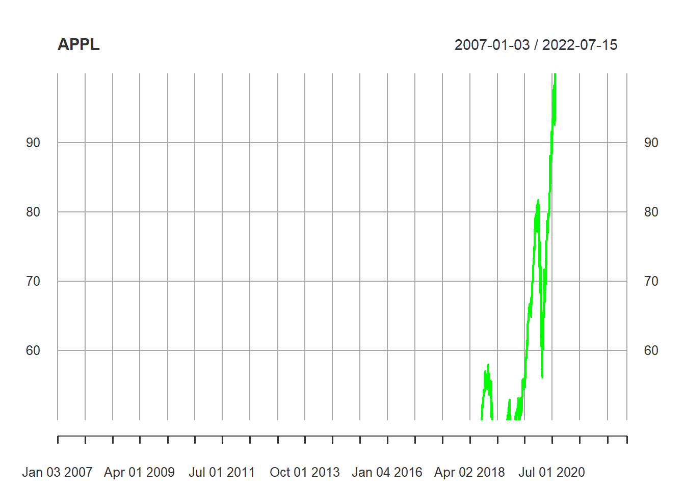
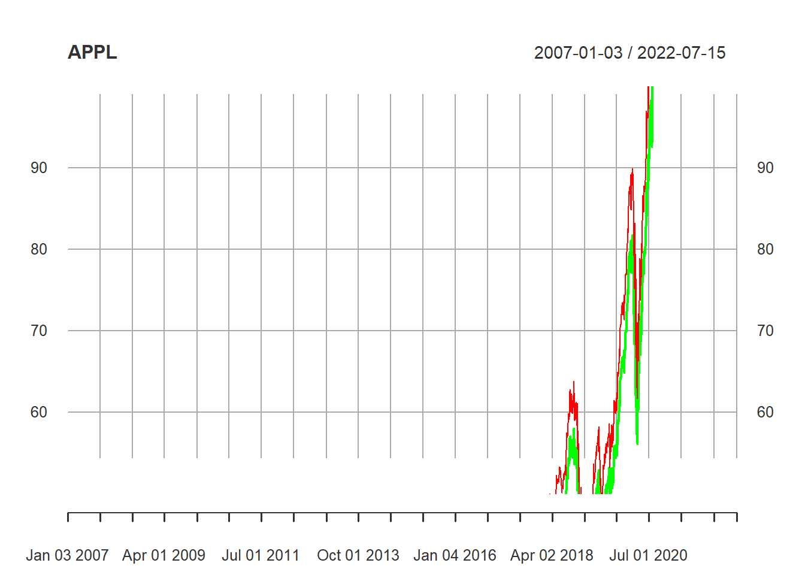
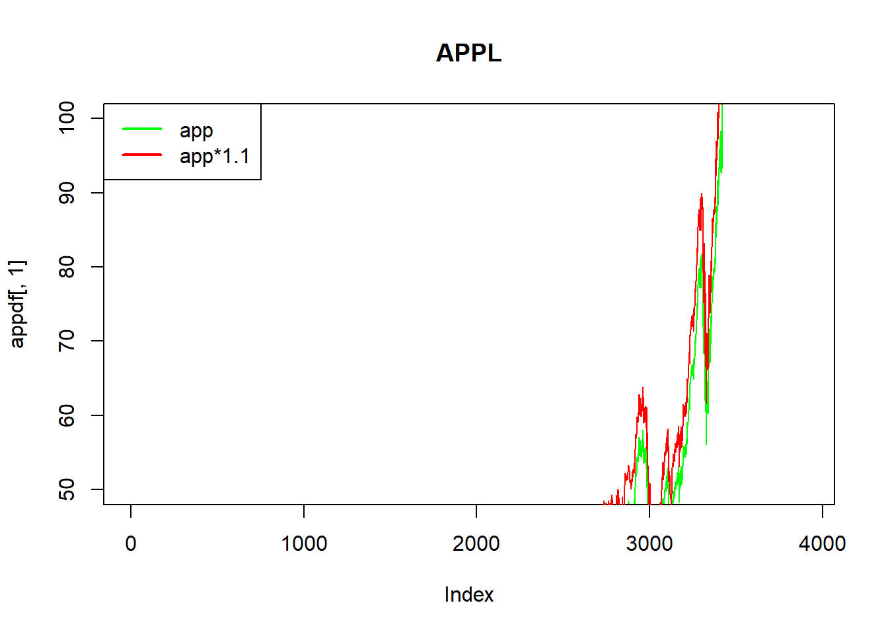

# APIS and R graphs {#graphs}


We have pending the contents:
reviewing categories in a column of a data frame (DF);
- Filtering in  a column of a "DF;
- Conditional function "ifelse";
- Detecting and replacing missing values;
- Estimating mean, media;
- Replacing missing values by a value such as as a median, mean, etc; or eliminating rows in a missing values. 

We will cover those contents while we cover the other contents. 

## 1. APIs  API´s (Application Programming Interface)

Descargar de Canvas: R graphs and data bases a.Rmd 

### 1.1 Quantmod API
Quantitative Financial Modelling Framework


The quantmod package for R is designed to assist the quantitative trader in the development, testing,
and deployment of statistically based trading models.

The function getSymbols is a wrapper to load data from various sources, local or remote. 


Getting a tikcer from https://finance.yahoo.com/ 
getSymbols("Symbol")
	


```r
library(quantmod)

getSymbols("AAPL")
#> [1] "AAPL"
class(AAPL)
#> [1] "xts" "zoo"

# objetos xts son como data frames, solo que la fecha del precio es el índice
```

To eliminate warnings, we could add the argument warnings = F

Getting the data from an specific date:

getSymbols("symbol", from="YY/m/d",to="YY/m/d")

Where: YY= is 4 digit year, m= 2 digit month, d= 2 digit day.
           

```r
getSymbols("AMZN", from="2020/04/01",to="2022/04/04")
#> [1] "AMZN"
```

An xts class of object provide for uniform handling of R's different time-based data classes.

Into an environment
data <- new.env()
getSymbols("ticker",env=data)

```r
# otra forma de descrgar los datos, dandole nombre al objeto
apple2 <- new.env()
getSymbols("AAPL", env=apple2)
#> [1] "AAPL"
class(apple2) # el objeto apple2, es un environmte o una lista, almacena varios tipos de objetos.
#> [1] "environment"
```


Intraday from
https://www.alphavantage.co/

getSymbols("ticker", src="av", api.key="yourKey", output.size="full",
periodicity="intraday")


```r
getSymbols("AAPL", src="av", api.key="yourKey", output.size="full",
periodicity="intraday",interval="5min")
#> [1] "AAPL"
```


Dividends
getDividends("ticker"), the xts objetc if the ticker  needs to be in the R environment

```r
# Al parecer solo si ticker tiene iformación de divididendos
ap_div<-getDividends("AAPL")
```
Descargar a m

i PC en xlsx o en csv

```r
#write.csv(AMZN,"MY_AMZN.csv")

library(openxlsx)
write.xlsx(AMZN,"MY_AMZN.xlsx")
```

Break de 10 min, regresamos a las 12, 
regresamos para kahoot


### 1.2 In-house Api 

(this will not be covered in the final exam or activities, is only for exposition)

```r
library(xml2)
library(rvest)
```

Harvesting the web with rvest (to get tickers)


This code is to read characters from web pages. In this case, to get the tickers from yahoo finance.


```r
# the page of of the criptocurrencies
#yf <- "https://finance.yahoo.com/cryptocurrencies/"

# for the IPC components
yf <- "https://finance.yahoo.com/quote/%5EMXX/components?p=%5EMXX"
html <- read_html(yf)
# To get the node a, wich contains characters 
node <- html_nodes(html,"a")

# To read the text in the node
node<-html_text(node, trim=TRUE)

# To get the elements that have USD (the tickers). For the IPC tickers, replace "USD" with ".MX". For other tickers, print the node object and look for patterns or select by rows.
#tickers<-grep(pattern = "USD", x = node, value = TRUE)

tickers<-grep(pattern = ".MX", x = node, value = TRUE)

# to get only the first 5 tickers

tickers1<-tickers
tickers1
#>  [1] "IENOVA.MX"     "AMXL.MX"       "ASURB.MX"      "GCC.MX"       
#>  [5] "TLEVISACPO.MX" "MEGACPO.MX"    "GFNORTEO.MX"   "FEMSAUBD.MX"  
#>  [9] "GMEXICOB.MX"   "GENTERA.MX"    "GCARSOA1.MX"   "LABB.MX"      
#> [13] "BBAJIOO.MX"    "GRUMAB.MX"     "GAPB.MX"       "PINFRA.MX"    
#> [17] "AC.MX"         "CEMEXCPO.MX"   "OMAB.MX"       "ALSEA.MX"     
#> [21] "KIMBERA.MX"    "BOLSAA.MX"     "CUERVO.MX"     "BIMBOA.MX"    
#> [25] "ALPEKA.MX"     "LIVEPOLC1.MX"  "MEXCHEM.MX"    "KOFL.MX"      
#> [29] "PEOLES.MX"     "SITESB1.MX"
```


```r
getSymbols(tickers1[1:2]) 
#> [1] "IENOVA.MX" "AMXL.MX"
```

### 1.3 Nasdaq Data Link API

You need to create an account (I suggest for you a free academic account)

Nasdaq Data Link API (before it eas Quandl)  https://data.nasdaq.com/


The class of objects from Quandl are Data Frames, but if e add the argument: type="xts", an xts object we get.

Emerging Markets High Grade Corporate Bond Index Yield


```r
library(Quandl)
# por default como data frame, pero podemos darle unargumento para que sea xts la descarga
eurex<-Quandl("ML/EMHGY", api_key="e7Z7FD5siZ8mDi_yTVLD",type="xts")
# api_key 
head(eurex)
#>            [,1]
#> 1998-12-31 8.48
#> 1999-01-04 8.48
#> 1999-01-05 8.46
#> 1999-01-06 8.37
#> 1999-01-07 8.43
#> 1999-01-08 8.40
```


```r
tickers<-data.frame(tickers)
```


## 2. databases handling (xts objects)
Subset by year, for example 2015
object["year"]

tickers<-c("AAPL","AMZN")

```r
tickers<-c("AAPL","AMZN")
# vector de caracteres
getSymbols(tickers)
#> [1] "AAPL" "AMZN"
```

```r
# que app solo tuvses el precio de cierre de apple
app<-AAPL[1:100,4]
# juntar precio de cierre de apple y de amazon en un osolo objeto, usando cbind
dim(app)
#> [1] 100   1
dim(AMZN)
#> [1] 3911    6
# CON OBJETOS XTS SI PUEDO USAR cbind para combinar estos dos objetos aunque tenga diferente dimension
# voy a genera o tro ojeto que sea precio de cierre de amz
am<-AMZN[,4]
both<-cbind(app,am)
head(both)
#>            AAPL.Close AMZN.Close
#> 2007-01-03   2.992857     1.9350
#> 2007-01-04   3.059286     1.9450
#> 2007-01-05   3.037500     1.9185
#> 2007-01-08   3.052500     1.8750
#> 2007-01-09   3.306071     1.8890
#> 2007-01-10   3.464286     1.8575
tail(both)
#>            AAPL.Close AMZN.Close
#> 2022-07-08         NA     115.54
#> 2022-07-11         NA     111.75
#> 2022-07-12         NA     109.22
#> 2022-07-13         NA     110.40
#> 2022-07-14         NA     110.63
#> 2022-07-15         NA     113.55
# na son missin values o datos faltantes
```


Merging xts objects. We mentioned before that the data frames could not be merged spplying cbind when do not have the same numbers of rows. The xts objects can be merged even when it does not have the same numbers of rows, because are merged by their index (the dates).


Making Subset in xts objects.

name<-subset(object,
  +index(object)>="YY-mm-dd" &
  +index(object)<="YY-mm-dd") 
  

```r
library(quantmod)
tickers<-c("AAPL","AMZN")
# vector de caracteres
getSymbols(tickers)
#> [1] "AAPL" "AMZN"
app<-AAPL[,4]
am<-AMZN[,4]
both<-cbind(app,am) 
head(both)
#>            AAPL.Close AMZN.Close
#> 2007-01-03   2.992857     1.9350
#> 2007-01-04   3.059286     1.9450
#> 2007-01-05   3.037500     1.9185
#> 2007-01-08   3.052500     1.8750
#> 2007-01-09   3.306071     1.8890
#> 2007-01-10   3.464286     1.8575
# crear un subset de periodo 7 de marzo al 7 de abril 2022
# primer arguemnto nombre del objecto
sub_1<-subset(both,
  +index(both)>="2022-03-07" &
  +index(both)<="2022-04-07")
sub_1
#>            AAPL.Close AMZN.Close
#> 2022-03-07     159.30   137.4530
#> 2022-03-08     157.44   136.0145
#> 2022-03-09     162.95   139.2790
#> 2022-03-10     158.52   146.8175
#> 2022-03-11     154.73   145.5245
#> 2022-03-14     150.62   141.8530
#> 2022-03-15     155.09   147.3665
#> 2022-03-16     159.59   153.1040
#> 2022-03-17     160.62   157.2390
#> 2022-03-18     163.98   161.2505
#> 2022-03-21     165.38   161.4915
#> 2022-03-22     168.82   164.8890
#> 2022-03-23     170.21   163.4080
#> 2022-03-24     174.07   163.6495
#> 2022-03-25     174.72   164.7735
#> 2022-03-28     175.60   168.9905
#> 2022-03-29     178.96   169.3150
#> 2022-03-30     177.77   166.3010
#> 2022-03-31     174.61   162.9975
#> 2022-04-01     174.31   163.5600
#> 2022-04-04     178.44   168.3465
#> 2022-04-05     175.06   164.0550
#> 2022-04-06     171.83   158.7560
#> 2022-04-07     172.14   157.7845
```


In financial series it is common to converts an xts object into a lower periodicity (e.g., days converted to months or years) specified by period with the OHLC statistics.  It could work for OHLC objects:  “Open”, “High”, “Low”, “Close”, “Volume”, or “Adjusted”.


The function to.period takes the last day of the time series, is not the average. 

to.period(object, period = "months", OHLC = T)


```r
# supports: "seconds", "minutes", "hours", "days", "weeks", "months", "quarters", and "years".
# vamos a convertir  app en datos semanales
#OHLC CONTIENEN LA INFORMACION DE apertura, cierre, volumne, etc
app_2<-to.period(app, period = "weeks", OHLC =T )
# si OHLC T entonces me incorpora precios de apertura, cierre, volumen, etc (los mismis que vienen de origen de getSymbol, si F, entonces solo el precio que vienene en el objecto)
head(app_2)
#>            app.Open app.High  app.Low app.Close
#> 2007-01-05 2.992857 3.059286 2.992857  3.037500
#> 2007-01-12 3.052500 3.464286 3.052500  3.379286
#> 2007-01-19 3.467857 3.467857 3.160714  3.160714
#> 2007-01-26 3.099643 3.099643 3.049286  3.049286
#> 2007-02-02 3.069286 3.069286 3.026429  3.026786
#> 2007-02-09 2.997857 3.077857 2.973929  2.973929
```

## 3. Graphs (Plots)
 The  basic function for ploting is plot(x, type = "h", col = "red", lwd = 10, "xlab","ylab").
In help plot.xy and plot.default we can see the arguments.
Plot the HSI close price



Adding another vector of information (another stock price, for example)
lines


We use lines to add another time serie


Adding leggend

The function legends only work with data frames, not xts., then we transform it in dataframe
as.data.frame(object)


legend(x= "topleft", legend = c("objst","objt2"),lty = 1,col=c("green","red"))


For more details of legends look in http://www.sthda.com/english, for the legend function arguments.

De los temas pendientes, el de detectar valores faltantes (missing values o NA´s) y estimar medidas como la media, mediana, etc. 


```r
tickers<-c("AAPL","AMZN")
# vector de caracteres
getSymbols(tickers)
#> [1] "AAPL" "AMZN"
app<-AAPL[1:100,4]
am<-AMZN[1:110,4]
both<-cbind(app,am) 
# primra forma de viuzalizar si existen mising valus
summary(both)
#>      Index              AAPL.Close      AMZN.Close   
#>  Min.   :2007-01-03   Min.   :2.974   Min.   :1.821  
#>  1st Qu.:2007-02-12   1st Qu.:3.080   1st Qu.:1.919  
#>  Median :2007-03-22   Median :3.252   Median :2.012  
#>  Mean   :2007-03-23   Mean   :3.326   Mean   :2.367  
#>  3rd Qu.:2007-05-01   3rd Qu.:3.422   3rd Qu.:3.065  
#>  Max.   :2007-06-11   Max.   :4.058   Max.   :3.683  
#>                       NA's   :10
```

Otra forma de detectar si tenemos datos faltantes es con función is.na()

```r
sum(is.na(both)) 
#> [1] 10
```
Que puedo hacer para coregir el tema de los misisng values
1. Elimiar todo el renglón con fuión na.omit()

```r
both_2<-na.omit(both)
sum(is.na(both_2))
#> [1] 0
dim(both)
#> [1] 110   2
dim(both_2)
#> [1] 100   2
```
2. Alternativa 2, es reemplazar los missing values por alguna medida como la media, mediana

```r
# estimar la media y la media de primera collumna de both
# función mean(objeto)
me<-mean(both[,1],na.rm=T)
# na.rm=T entonces, amite los nas, y realizae el calculo, si na.rm=F no realices elc alculo y arroja NA
med<-median(both[,1],na.rm=T)
med
#> [1] 3.251786
```


- Conditional function "ifelse";
- Detecting and replacing missing values;
- Estimating mean, media;
- Replacing missing values by a value such as as a median, mean, etc; or eliminating rows in a missing values. 
- Filtering in  a column of a "DF;
