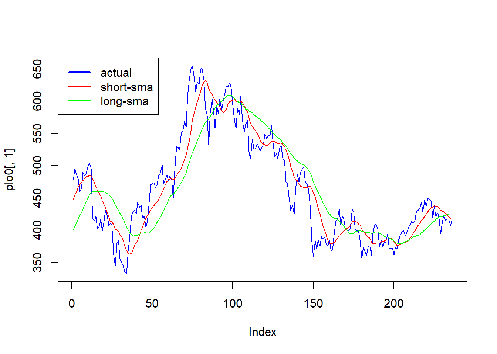
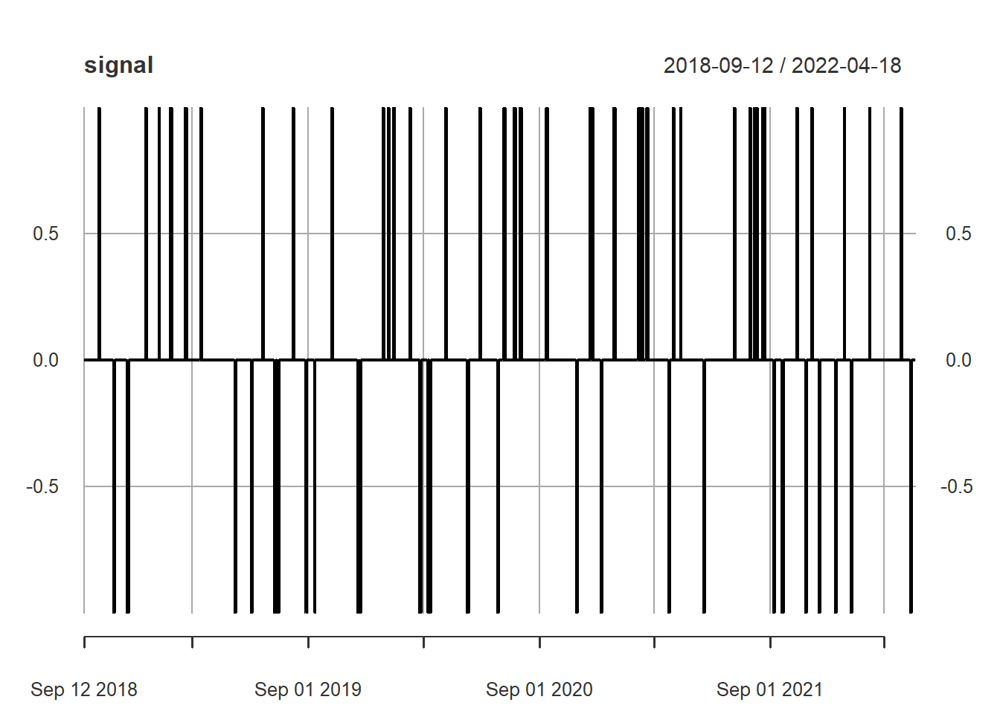

# Machine learning with market direction prediction: Logit {#logit}

 
Today we will cover machine learning with market direction prediction. In particular, we will forecast the market moves either upward or downward. 

A logistic regression (Logit) and Linear Discriminant Analysis (LDA) models help us to fit a model using binary behavior (up or down)  and forecast market direction. Logistic regression.

## Data preparation

```r
library("quantmod")
ticker<-"BNB-USD"
data<-getSymbols(ticker,from="2021-08-01",to="2022-04-18",warnings =FALSE,auto.assign=FALSE)
data<-data[,4]
colnames(data)<-"bnb"
lag2<-12
lag3<-9
lag4<-26
avg<-SMA(data[,1],lag2) # var1
avg2<-SMA(data[,1],lag4) # var1
data2<-cbind(data,avg,avg2)
data2<-na.omit(data2)
```


The following commands are to create variable direction with either Up direction (1) or Down direction (0). In other words, Up up direction is a signal o buying and and down could be a signal of not buying. For this example, direction variable is created when a short SMA is greater than a long SMA and zero otherwise.


First we make a plot. 


```r
#par(mfrow=c(2,1))
plo0<-as.data.frame(data2[,1])
plo<-as.data.frame(data2[,2])
plo1<-as.data.frame(data2[,3])

plot(plo0[,1],col="blue",type="l")
lines(plo[,1],col="red",type="l")
lines(plo1[,1],col="green",type="l")
legend(x= "topleft", legend = c("actual","short-sma","long-sma"),lty = 1,lwd=2,col=c("blue","red","green"))
```




Now we create the signal.

```r
# ifelse(condición,si se cumple la condición,si no se cmple la condición)
# si el SMA corto > SMA largo, 1,0) 
signal<-ifelse(data2[,"SMA"]>data2[,"SMA.1"],1,0)
plot(signal)
```


```r
# El numero 1 es señal de compra de Binance y cero es no comprar. 
```


As in the machine learning example, where we predict BNB price, our model is:

$$ signal_{t}=\alpha\ +\beta1\ macd_{t-1}+\beta2\ rsi_{t-2} +\beta3\ bb +\ e $$


The only difference is the independent variable, in this case is signal. 


```r
std<- rollapply(data[,1],lag2,sd) # var2
colnames(std)<-"std"

macd<- MACD(data[,1], lag2,lag3,lag4, "SMA") # var2
macd2<- MACD(data[,1], 11,25,8, "SMA") 
colnames(macd)[2]<-"macd_signal"


rsi<-  RSI(data[,1],lag2,"SMA")# var3
rsi2<-  RSI(data[,1],13,"SMA")# var3

bb <- BBands(data2[,1], n = 10, maType="SMA", sd = 2) 

# Agregar el nombre de signal en lugar de sig
data2<-cbind(signal,std,macd,rsi,bb)
colnames(data2)[1]<-"signal"
data2<-na.omit(data2)
```


We separate the sample into training and testing. The training data set is used for the building model process, and the testing dataset is used for evaluation purposes. 


```r
N<-dim(data2)[1]
n_train<-round(N*.8,0)
part<-index(data2)[n_train]
#This is the test data set.
train<-subset(data2,
  +index(data2)>=index(data2)[1] &
  +index(data2)<=part)

# The subset of the training data set.
test<-subset(data2,
  +index(data2)>=part+1 &
  +index(data2)<="2022-04-18")
y1<-test[,1] # contiene la varaible que voy a pronosticar
#test<-test[,-1] # las variables independientes, que voy a usar para haver mi pronóstico
```


## Logistic Regression

The linear regression assumes that the response variable Y is quantitative. But in many situations, the response variable is instead qualitative. For example, eye color is qualitative, taking on values blue, brown, or green. Often qualitative variables are referred to as categorical ; we will use these terms interchangeably.

In a binary response model, interest lies primarily in the response probability. However, we can not use the OLS to estimate the model, because it is a not linear binary response model. Then we apply Logistic regression.

glm(y ~.,data= ,family=binomial())


```r
model<-glm(signal~.,data= train,family=binomial())
pred<-predict(model,test)
pred
#> 2022-03-05 2022-03-06 2022-03-07 2022-03-08 2022-03-09 2022-03-10 2022-03-11 
#>  1.4071871  0.7838451  1.1688270  1.5835724  0.6400374  1.1018749  1.5094064 
#> 2022-03-12 2022-03-13 2022-03-14 2022-03-15 2022-03-16 2022-03-17 2022-03-18 
#> -1.2026024 -2.0134675 -2.4429877 -1.9810255 -0.7260440 -1.5145946 -0.3496281 
#> 2022-03-19 2022-03-20 2022-03-21 2022-03-22 2022-03-23 2022-03-24 2022-03-25 
#> -0.7131193 -0.6484040 -1.3564305  1.4355937  1.6560035  2.0060744  3.8742966 
#> 2022-03-26 2022-03-27 2022-03-28 2022-03-29 2022-03-30 2022-03-31 2022-04-01 
#>  3.5987035  3.9839923  4.1817522  4.1877168  3.9090570  2.9184529  3.7917209 
#> 2022-04-02 2022-04-03 2022-04-04 2022-04-05 2022-04-06 2022-04-07 2022-04-08 
#>  3.4630973  2.7885380  2.6969620  2.6106934  4.1880525  3.2083981  3.0614675 
#> 2022-04-09 2022-04-10 2022-04-11 2022-04-12 2022-04-13 2022-04-14 2022-04-15 
#>  2.6747753  2.6183627  1.9073456  2.0025636  0.6854552  1.0431508 -0.2146935 
#> 2022-04-16 2022-04-17 2022-04-18 
#> -0.1493334  0.3593882  0.6847538
```

We expect a forecast of a 0,1 result, as the signal. Then we transform it into a probabilistic model.
exp(x)/(1+exp(x))


```r
prob<-exp(pred)/(1+exp(pred))
```

Even when the result is a probability, between 0 and 1, we require a result 0,1. Then we transform it, creating a binary variable, that takes the value of 1 when the probability is higher than 0.5, and zero when is lower than 0.5. 

```r
predf<-ifelse(prob>.5,1,0)
plot(predf)
```


```r
# comparar vs el dato real que estaé en y1
```

## Confusion matrix

To measure the accuracy of the prediction, for categorical variables, such as 0,1,  confusion matrix is a table that indicates the possible categories of predicted values, and  actual values. 

Where True Positive (TP): Correctly classified as the class of interest. True Negative (TN) is Correctly classified as not the class of interest. False Positive (FP) is Incorrectly classified as the class of interest. False Negative (FN): Incorrectly classified as not the class of interest. 

In the confusion matrix, one of the mesures of interest is the accuracy, defined as:

$$ accuracy =\frac{TP+TN}{TP+TN+FP+FN}$$

In this formula, the terms TP, TN, FP, and FN refer to the number of times the model's predictions fell into each of these categories. The accuracy is therefore a proportion that represents the number of true positives and true negatives, divided by the total number of predictions.

con 7 var
RMSE de 7

con 11 var
RMSE de 6.5


factor(x,levels=c(1,0))
confusionMatrix(pred,real)

```r
library(caret)
# convertir en data frame  predf
predf2<-as.data.frame(predf)
predf3<-factor(predf2[,1],levels=c(1,0)) # niveles, el primer dato, el 1, es  la variable de mi interés. 
real<-factor(y1,levels=c(1,0))
confusionMatrix(predf3,real) # primero va la predicción y después el dato real
#> Confusion Matrix and Statistics
#> 
#>           Reference
#> Prediction  1  0
#>          1 25  8
#>          0  0 12
#>                                         
#>                Accuracy : 0.8222        
#>                  95% CI : (0.6795, 0.92)
#>     No Information Rate : 0.5556        
#>     P-Value [Acc > NIR] : 0.0001572     
#>                                         
#>                   Kappa : 0.625         
#>                                         
#>  Mcnemar's Test P-Value : 0.0133283     
#>                                         
#>             Sensitivity : 1.0000        
#>             Specificity : 0.6000        
#>          Pos Pred Value : 0.7576        
#>          Neg Pred Value : 1.0000        
#>              Prevalence : 0.5556        
#>          Detection Rate : 0.5556        
#>    Detection Prevalence : 0.7333        
#>       Balanced Accuracy : 0.8000        
#>                                         
#>        'Positive' Class : 1             
#> 
(25+12)/(25+12+8+0)
#> [1] 0.8222222
```

Sensitivity 

Finding a useful classifier often involves a balance between predictions that are overly conservative and overly aggressive. For example, an e-mail filter could guarantee to eliminate every spam message by aggressively eliminating nearly every ham message at the same time. On the other hand, guaranteeing that no ham message is inadvertently filtered might require us to allow an unacceptable amount of spam to pass through the filter. A pair of performance measures captures this trade off: sensitivity and specificity.

The sensitivity of a model (also called the true positive rate) measures the proportion of positive examples that were correctly classified. Therefore, as shown in the following formula, it is calculated as the number of true positives divided by the total number of positives, both correctly classified (the true positives) as well as incorrectly classified (the false negatives):

$$sensitivity =\frac{TP}{TP+FN}$$


## Linear Discriminant Analysis LDA

Why do we need another method, when we have logistic regression?
There are several reasons:

• When the classes are well-separated, the parameter estimates for the
logistic regression model are surprisingly unstable. Linear discriminant
analysis does not suffer from this problem.

• If number of observations *n* is small and the distribution of the predictors X is approximately normal in each of the classes, the linear discriminant model is again more stable than the logistic regression model.

• Finally, when we have more than 2 categories, for example, c(-1,0,1).


```r
library("quantmod")
ticker<-"BNB-USD"
data<-getSymbols(ticker,from="2018-08-01",to="2022-04-18",warnings =FALSE,auto.assign=FALSE)
data<-data[,4]
colnames(data)<-"bnb"
lag2<-12
lag3<-18
lag4<-26
avg<-SMA(data[,1],lag2) # var1
avg2<-SMA(data[,1],lag3) # var1
avg3<-SMA(data[,1],lag4) # var1
data2<-cbind(data,avg,avg2,avg3)
data2<-na.omit(data2)

std<- rollapply(data[,1],lag2,sd) # var2
colnames(std)<-"std"
macd<- MACD(data[,1], lag2,lag3,lag4, "SMA") # var2
colnames(macd)[2]<-"macd_signal"
rsi<-  RSI(data[,1],lag2,"SMA")# var3
bb <- BBands(data2[,1], n = 10, maType="SMA", sd = 2) 

data2<-cbind(data,std,macd,rsi,bb)
#colnames(data2)[1]<-"signal"
data2<-na.omit(data2)
```


Signal creation, now 3 categories c(-1,0,1)


```r
signal <- ifelse(data2[,1]> data2[,'up'] & data2[,'macd']> data2[,'macd_signal'],1,ifelse(data2[,1]< data2[,'dn'] & data2[,'macd'] <data2[,'macd_signal'],-1,0))
plot(signal)
```



1 es señal de compra, -1 de venta (o venta en corto), y cero es no hacer nada (ni comprar ni vender).

$400 espero que baje 380. 

Combinig data2 and signal

```r
#We first replace bnp by signal 
data2<-data2[,-1]

# Eliminate up, because is causing issues (correlated with mavg, and does not allow estimate the model)
data2<-data2[,-6]
data2<-cbind(signal,data2)
colnames(data2)[1]<-"signal"
```


Training and test partition

```r
N<-dim(data2)[1]
n_train<-round(N*.8,0)
part<-index(data2)[n_train]
#This is the test data set.
train<-subset(data2,
  +index(data2)>=index(data2)[1] &
  +index(data2)<=part)

# The subset of the training data set.
test<-subset(data2,
  +index(data2)>=part+1 &
  +index(data2)<="2022-04-18")

train<-train[,-6]
test<-test[,-6]

y1<-test[,1] # contiene la varaible que voy a pronosticar
#test<-test[,-1] # las variables independientes, que voy a usar para haver mi pronóstico
```


LDA model and prediction
lda(x~.,data= , prior = c(1,1,1)/3)

```r
library(MASS)
modellda<-lda(signal~.,data= train, prior = c(1,1,1)/3)
pred<-predict(modellda,test)
pred<-pred[["class"]]
class(pred)
#> [1] "factor"

library(caret) 
real<-factor(y1,levels=c(-1,0,1))
confusionMatrix(pred,real) 
#> Confusion Matrix and Statistics
#> 
#>           Reference
#> Prediction  -1   0   1
#>         -1   8  18   0
#>         0    0 199   0
#>         1    0  27  11
#> 
#> Overall Statistics
#>                                           
#>                Accuracy : 0.8289          
#>                  95% CI : (0.7778, 0.8724)
#>     No Information Rate : 0.9278          
#>     P-Value [Acc > NIR] : 1               
#>                                           
#>                   Kappa : 0.4079          
#>                                           
#>  Mcnemar's Test P-Value : NA              
#> 
#> Statistics by Class:
#> 
#>                      Class: -1 Class: 0 Class: 1
#> Sensitivity            1.00000   0.8156  1.00000
#> Specificity            0.92941   1.0000  0.89286
#> Pos Pred Value         0.30769   1.0000  0.28947
#> Neg Pred Value         1.00000   0.2969  1.00000
#> Prevalence             0.03042   0.9278  0.04183
#> Detection Rate         0.03042   0.7567  0.04183
#> Detection Prevalence   0.09886   0.7567  0.14449
#> Balanced Accuracy      0.96471   0.9078  0.94643
```


