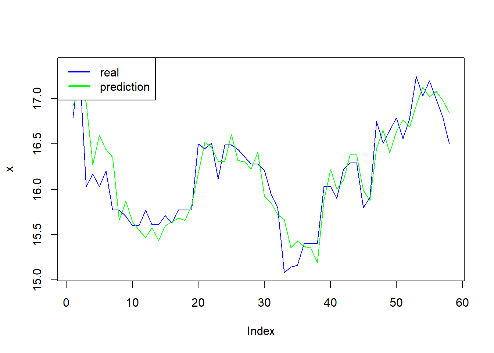

# Big data and machine learning

 


Predicting market direction of a price is quite a challenging task as market data involves lots of noise. The market moves either upward or downward, and the nature of the market movement is binary (Jeet and Vat, 2017).

In this session, we use a OLS, to predict a 1 day open price, the price of the 19 April 2022,  of a cryptocurency, in this case Bianance, "BNB-USD". Some ideas and code are adapted from  Jeet and Vat (2017). 

Binance Launched in July 2017, Binance is the biggest cryptocurrency exchange globally based on daily trading volume. Binance aims to bring cryptocurrency exchanges to the forefront of financial activity globally. The idea behind Binance’s name is to show this new paradigm in global finance — Binary Finance, or Binance.

## Data preparation


```r
library("quantmod")
ticker<-"LALAB.MX"
y<-getSymbols(ticker,from="2021-01-01",to="2022-04-18",warnings =FALSE,auto.assign=FALSE)
# the auto.assign=FALSE allow us to store the data in a variable, in this case "y", and not only in the RStudio environment.
y<-y[,1]
colnames(y)<-"bnb"
head(y)
#>              bnb
#> 2021-01-04 15.54
#> 2021-01-05 15.23
#> 2021-01-06 15.75
#> 2021-01-07 15.81
#> 2021-01-08 15.90
#> 2021-01-11 15.64
```

We are going to start with an OLS (Ordinary least square) model. As independent variables we are using some lags of the independent variable. 

For simplicity, suppose that to predict the 19 April 2022 BNB price, we  make a regression, by OLS, of the following model:

$$bnb_{t}=\alpha\ +\beta1\ bnb_{t-1}+\beta2\ bnb_{t-2} + e $$

where $\alpha$ is intercept, $beta$ are the parameters to be estimated, $bnb_{t-1}$ are the bnb price of the traiding previouse day, in this case 18 April 2022, and  $bnb_{t-2}$ is the bnb price of the day before, 17 April 2022, and "e" is the the error term of the regression. In other words, the price of today is explained by the price of yesterday and the day before yesterday. 

data<-stats::lag(y,lag)

```r
lag<-1
lag1<-2
data<-stats::lag(y,lag)
data2<-stats::lag(y,lag1)
data<-cbind(y,data,data2)
colnames(data)[2:3]<-c("bnb_1","bnb_2")
```

Para realizar la regresión por OLS
lm(bnb~.,data=data)

```r
model<-lm(bnb~.,data=data)
summary(model)
#> 
#> Call:
#> lm(formula = bnb ~ ., data = data)
#> 
#> Residuals:
#>      Min       1Q   Median       3Q      Max 
#> -1.25123 -0.13298  0.00724  0.08428  1.92931 
#> 
#> Coefficients:
#>             Estimate Std. Error t value Pr(>|t|)    
#> (Intercept)  0.40151    0.20665   1.943   0.0529 .  
#> bnb_1        0.88236    0.05571  15.837   <2e-16 ***
#> bnb_2        0.09303    0.05572   1.670   0.0960 .  
#> ---
#> Signif. codes:  0 '***' 0.001 '**' 0.01 '*' 0.05 '.' 0.1 ' ' 1
#> 
#> Residual standard error: 0.2664 on 319 degrees of freedom
#>   (2 observations deleted due to missingness)
#> Multiple R-squared:  0.9486,	Adjusted R-squared:  0.9482 
#> F-statistic:  2941 on 2 and 319 DF,  p-value: < 2.2e-16
```


Also, suppose we found the following result of the regression:

$$bnb_{t}=\ 52.42583\ +\ 0.88235\ bnb_{t-1}\ -0.01226\ bnb_{t-2} $$

```r
tail(y)
#>              bnb
#> 2022-04-06 17.25
#> 2022-04-07 17.03
#> 2022-04-08 17.20
#> 2022-04-11 17.00
#> 2022-04-12 16.80
#> 2022-04-13 16.50
```


In this case, the forecast of the 19 April 2022 would be:

```r
bnb_t1<-406.3009 # price 18 April 2022
bnb_t2<-417.4115 # price 17 April 2022

47.13630+0.90113*bnb_t1-0.01765*bnb_t1
#> [1] 406.095
```
Given that the last price is 406.3009.

However, the last example was only for exposition purposes. In reality, we need to test other independent variables besides the lags of the dependent variable. For this session, besides the lags values if the close prices as the dependent variable, we are going to add some variables used in technical analysis, such as moving average, standard deviation, RSI (see appendix for a detailed explanation), MACD, and so on, which has some predictive power in market direction. These indicators can be constructed using the following commands:

## Variable creation

- SMA Calculate a moving averages 
SMA(x, n = 10, ...), where x is the time serie, n is the Number of periods to average over

- The rollapply is a function for applying a function to rolling margins of an array, in this case we used to make a moving standard deviation.
rollapply(x,n,sd), where sd is standard deviation

- The MACD is the moving average converge diverge (see Appendix)
- MACD(x, nFast = 12, nSlow = 26, nSig = 9, maType=SMA or EMA)

- RSI is the relative strength index 
RSI(x, n = 14, maType=SMA or EMA)


```r
lag2<-6
lag3<-9
lag4<-26
avg<-SMA(data[,1],lag2) # var1
std<- rollapply(data[,1],lag2,sd) # var2
colnames(std)<-"std"

macd<- MACD(data[,1], lag2,lag3,lag4, "SMA") # var2
colnames(macd)[2]<-"macd_signal"
  
rsi<-  RSI(data[,1],lag2,"SMA")# var3


data2<-cbind(data,avg,std,macd,rsi)
head(data2)
#>              bnb bnb_1 bnb_2    SMA       std macd macd_signal rsi
#> 2021-01-04 15.54    NA    NA     NA        NA   NA          NA  NA
#> 2021-01-05 15.23 15.54    NA     NA        NA   NA          NA  NA
#> 2021-01-06 15.75 15.23 15.54     NA        NA   NA          NA  NA
#> 2021-01-07 15.81 15.75 15.23     NA        NA   NA          NA  NA
#> 2021-01-08 15.90 15.81 15.75     NA        NA   NA          NA  NA
#> 2021-01-11 15.64 15.90 15.81 15.645 0.2393951   NA          NA  NA
```


Then our model is:
$$bnb_{t}=\alpha\ +\beta1\ bnb_{t-1}+\beta2\ bnb_{t-2} +\beta3\ sma +\\ \beta4\ std\ +\beta5\ macd\ + \beta6\ rsi +\ e$$

As we see, because of the lags and new variables, we have many missing values in the early dates, then we apply the na.omit, to eliminate the rows with nas. 

```r
data2<-na.omit(data2)
```


## Sub samples 
We separate the sample into training and testing. The training data set is used for the building model process, and the testing dataset is used for evaluation purposes. 


This code automate the sub-sample creation, usually we split into 80% the training set and 20% the test set. 

```r
N<-dim(data2)[1]
n_train<-round(N*.8,0)
part<-index(data2)[n_train]
part
#> [1] "2022-01-19"
```

In this case, "2022-01-31" is the date that represents the 80% of all observations, where the starting date is "2022-01-01".

We use the function subset:

name<-subset(object,
  +index(object)>="YY-mm-dd" &
  +index(object)<="YY-mm-dd") 
  

```r

#This is the test data set.
train<-subset(data2,
  +index(data2)>=index(data2)[1] &
  +index(data2)<=part)

# The subset of the training data set.
test<-subset(data2,
  +index(data2)>=part+1 &
  +index(data2)<="2022-04-18")
```


To our forecast vs the real data, we are going to takeout the  real data of the BNB prices of the test set, and store it in an object call it y1.

```r
y1<-test[,1] # contiene la varaible que voy a pronosticar
#test<-test[,-1] # las variables independientes, que voy a usar para haver mi pronóstico
head(test)
#>              bnb bnb_1 bnb_2      SMA       std      macd macd_signal       rsi
#> 2022-01-20 16.79 16.80 16.91 17.19167 0.4656785 -1.077298  -0.1888210  3.816726
#> 2022-01-21 17.36 16.79 16.80 17.12667 0.3938356 -1.109900  -0.2228045 38.036818
#> 2022-01-24 16.03 17.36 16.79 16.83167 0.4478131 -1.976833  -0.2798782 19.587642
#> 2022-01-25 16.17 16.03 17.36 16.67667 0.4948401 -1.715669  -0.3048719 30.212749
#> 2022-01-26 16.03 16.17 16.03 16.53000 0.5401851 -1.470294  -0.3000546 30.869562
#> 2022-01-27 16.20 16.03 16.17 16.43000 0.5357239 -1.017469  -0.2740690 37.288156
```


## Making the model
We estimate a OLS model aplying the function lm, 

lm(bnb~.,data=train)

```r
model1<-lm(bnb~.,data=train)
summary(model1)
#> 
#> Call:
#> lm(formula = bnb ~ ., data = train)
#> 
#> Residuals:
#>      Min       1Q   Median       3Q      Max 
#> -0.69108 -0.09940  0.02329  0.10403  1.10734 
#> 
#> Coefficients:
#>               Estimate Std. Error t value Pr(>|t|)    
#> (Intercept) -0.0910104  0.1643070  -0.554   0.5802    
#> bnb_1        0.3459223  0.0643449   5.376 1.90e-07 ***
#> bnb_2       -0.2987632  0.0692119  -4.317 2.37e-05 ***
#> SMA          0.9308127  0.0896208  10.386  < 2e-16 ***
#> std          0.4042500  0.0749164   5.396 1.72e-07 ***
#> macd        -0.0430484  0.0225301  -1.911   0.0573 .  
#> macd_signal  0.0607983  0.0542453   1.121   0.2636    
#> rsi          0.0075120  0.0007548   9.952  < 2e-16 ***
#> ---
#> Signif. codes:  0 '***' 0.001 '**' 0.01 '*' 0.05 '.' 0.1 ' ' 1
#> 
#> Residual standard error: 0.1813 on 225 degrees of freedom
#> Multiple R-squared:  0.9802,	Adjusted R-squared:  0.9796 
#> F-statistic:  1594 on 7 and 225 DF,  p-value: < 2.2e-16
```

To make the prediction, we need to apply the function predict, but on the test set.  Break de 5 mins () a las 12:50 kahoot final.  

```r
pred<-predict(model1,test)
head(pred)
#> 2022-01-20 2022-01-21 2022-01-24 2022-01-25 2022-01-26 2022-01-27 
#>   16.92244   17.11869   16.96135   16.27277   16.59502   16.44019
pred
#> 2022-01-20 2022-01-21 2022-01-24 2022-01-25 2022-01-26 2022-01-27 2022-01-28 
#>   16.92244   17.11869   16.96135   16.27277   16.59502   16.44019   16.35616 
#> 2022-01-31 2022-02-01 2022-02-02 2022-02-03 2022-02-04 2022-02-08 2022-02-09 
#>   15.66042   15.86946   15.64015   15.54924   15.46544   15.57716   15.43428 
#> 2022-02-10 2022-02-11 2022-02-14 2022-02-15 2022-02-16 2022-02-17 2022-02-18 
#>   15.59519   15.64140   15.68066   15.65542   15.82226   16.17687   16.51849 
#> 2022-02-21 2022-02-22 2022-02-23 2022-02-24 2022-02-25 2022-02-28 2022-03-01 
#>   16.47065   16.31094   16.30532   16.60728   16.31808   16.30070   16.22510 
#> 2022-03-02 2022-03-03 2022-03-04 2022-03-07 2022-03-08 2022-03-09 2022-03-10 
#>   16.41384   15.92332   15.85047   15.72339   15.66347   15.35515   15.42859 
#> 2022-03-11 2022-03-14 2022-03-15 2022-03-16 2022-03-17 2022-03-18 2022-03-22 
#>   15.37003   15.35250   15.19145   15.87888   16.21718   16.00074   16.10055 
#> 2022-03-23 2022-03-24 2022-03-25 2022-03-28 2022-03-29 2022-03-30 2022-03-31 
#>   16.37870   16.38080   15.99185   15.87494   16.45360   16.65301   16.40199 
#> 2022-04-01 2022-04-04 2022-04-05 2022-04-06 2022-04-07 2022-04-08 2022-04-11 
#>   16.64081   16.76660   16.68875   16.92925   17.12510   17.01967   17.08268 
#> 2022-04-12 2022-04-13 
#>   16.98242   16.84476
```

Where the first prediction, of the 2022-04-04, 433.6627, is 

$$ bnb_{t}=\ -20.28047\ +\ 0.06146\ bnb_{t-1}\ -0.27979\ bnb_{t-2} + \\1.15805\ sma +\ 0.33934206\ std -3.76813\ macd\\ -6.68031\ macd\_ signal\ + 0.74661\ rsi $$


And so on. 

## Accuracy of the prediction

Lest make a  plot of the forecast vs the real value of BNB.

```r
# almanenar la predicción y el dato real en un objeto, DF
# convetir la pred en DF
pred2<-as.data.frame(pred)
# conv y1 en DF, # y1 tiene el dato real
y2<-as.data.frame(y1)
all<-cbind(y2,pred2)
# all[,1] plot de la primera columna del objeto all, type="l" no es uno, sino letra L minúscula.
plot(all[,1],type = "l",col="blue",ylab="x")
# lines es para agregar otra gráfica, 
lines(all[,2],col="green")
legend(x= "topleft", legend = c("real","prediction"),lty = 1,lwd=2,col=c("blue","green"))
```




Finaly, to measure the accuracy of our prediction, we apply the Root Mean Square Error (RMSE). It gives an idea of how much error the system typically makes in its predictions. The formula of the RMSE is:

$$RMSE =\frac{1}{n}\ \sum_{i=1}^{n} (y_{i}-\hat{f(x_{i}))^{2}} $$
where $ \hat{f(x_{i})} $ is the prediction for the ith observation (the actual), $ y_{i} $ is the observation ith of the independent variable, and n is the number of observations. 

$$\hat{f(x_{i})}=\hat{\beta_{0}}+\hat{\beta_{1}}x_{1}+,..,+\hat{\beta_{n}}x_{n}$$


The RMSE is computed using the training data that was used to fit the model, and so should more accurately be referred to as the training RMSE. 


Where, the RMSE close to zero, is the better.
sqrt(mean((real-forecast)^2,na.rm = T ))


```r
sqrt(mean((all[,1]-all[,2])^2,na.rm = T ))
#> [1] 0.242318
```
macd, sma, RSI 


## Appendix

The MACD and signals (from investopedia). 

Moving Average Convergence Divergence (MACD) is a trend-following momentum indicator that shows the relationship between two moving averages of a security’s price. The MACD is calculated by subtracting the 26-period Exponential Moving Average (EMA) from the 12-period EMA.

The result of that calculation is the MACD line. A nine-day EMA of the MACD called the "signal line," is then plotted with the MACD line, which can be a signal for buy and sell. Traders may buy the security when the MACD crosses above its signal line and sell - or short - the security when the MACD crosses below the signal line. 

An exponential moving average (EMA) is a type of moving average (MA) that places a greater weight and significance on the most recent data points. The exponential moving average is also referred to as the exponentially weighted moving average. An exponentially weighted moving average reacts more significantly to recent price changes than a simple moving average (SMA), which applies an equal weight to all observations in the period.

In the next example, by default, the function MACD creates a 12 days EMA and 26-days EMA.


The relative strength index (RSI)

Is a momentum indicator that measures the magnitude of recent price changes to evaluate overbought or oversold conditions in the price of a stock or other asset. The RSI is displayed as an oscillator (a line graph that moves between two extremes) and can have a reading from 0 to 100. The indicator was originally developed by J. Welles Wilder Jr. and introduced in his seminal 1978 book, New Concepts in Technical Trading Systems.

The Relative Strength Index (RSI) calculates a ratio of the recent upward price movements to the absolute price movement. Developed by J. Welles Wilder. The RSI calculation is RSI = 100 - 100 / ( 1 + RS ), where RS is the smoothed ratio of 'average' gains over 'average' losses. The 'averages' aren't true averages, since they're divided by the value of n and not the number of periods in which there are gains/losses.

Traditional interpretation and usage of the RSI are that values of 70 or above indicate that a security is becoming overbought or overvalued and may be primed for a trend reversal or corrective pullback (drop in a stock) in price. An RSI reading of 30 or below indicates an oversold or undervalued condition (Investopedia).

## Bibliography


Jeet, P  and Vat, P. (2017). Learning Quantitative finance with R (2017), Packt Publishing, Birmingham, UK.


