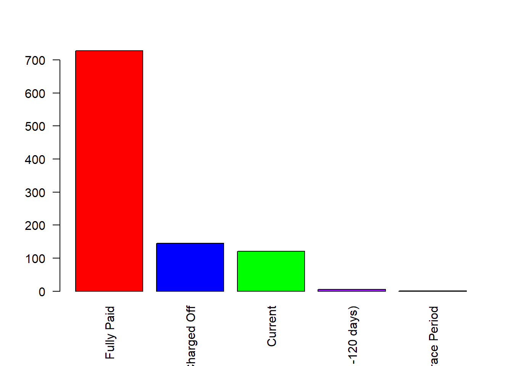

# Credit analysis


```r
library(openxlsx)
library(dplyr)
library(caret)
```


## Example 

The database credit_short.xlsx has historical information of lendingclub, https://www.lendingclub.com/ fintech marketplace bank at scale. One of the spreadsheets has the variable description. The original data set has at least 2 million observations and 150 variables. You will find the credit_semioriginal.xlsx with the first 1,000 observations.

In the following example, you will find an example of a "prediction model" for the credit_short.xlsx, which only has 26 variables.

dataset source:
https://www.kaggle.com/wordsforthewise/lending-club

### a) Independent variable creation

```r
df<-read.xlsx("credit_short.xlsx")
getwd()
#> [1] "C:/Users/abern/Documents_hp/R book algo and fina prog/Book 2"
```


Function count(df,col,sort = T) could give us the number of observations per category of the variable loan_status: 

```r
co<-count(df,loan_status,sort =T )
co
#>          loan_status   n
#> 1         Fully Paid 728
#> 2        Charged Off 145
#> 3            Current 121
#> 4 Late (31-120 days)   5
#> 5    In Grace Period   1
# para saber cuantas cztegorias tiene term
```


For this example, and for the evidence, we will create a binary variable, based on Fully Paid and Charged Off categories, which are equivalent to no-default and default respectively. 


Charge off" means that the credit grantor wrote your account off of their receivables as a loss, and it is closed to future charges. When an account displays a status of "charge off," it means the account is closed to future use, although the debt is still owed.


barplot(df$colsum , names.arg=df$colnames , las=2, 
                  col=c("red","blue","green","purple","black"),
                  ylim=c(0,700))
                  
df is the data frame name, colsum is the column of the data frame with the number for each categorie and colnames is the column of the data frame with the names of the categories. 

```r
co<-count(df,loan_status,sort =T )
barplot(co$n , names.arg=co$loan_status , las=2 , 
  col=c("red","blue","green","purple","black"),
                  ylim=c(0,700))
```




I make a filter, in such a way that the loan_status contains only Fully Paid and Charged Off:

library dplyr

%>% is a pipe to

df %>%
  filter(col== "r1" |col== "r2")
  df is a data frame, col is the column name, r1 and r2 is the category 1 and 2 respectively, in this case Fully Paid and Charged Off
  

```r
df2<-df %>%
  filter(loan_status == "Fully Paid" | loan_status== "Charged Off") 
count(df2,loan_status)
#>   loan_status   n
#> 1 Charged Off 145
#> 2  Fully Paid 728
```
  
For the logit model to run, we need to transform the loan_status into  (0,1), if "Fully Paid" then 0, and "Charged Off", 1. The relevant variable is "Charged Off", because we are concerned about the expected losses (if customers do not pay the loan).  

We apply the ifelse function and cbind to combine in an object.


```r
Default<-ifelse(df2$loan_status=="Fully Paid",0,1)
#Default<-factor(Default ,levels =c(1,0))
# combining default and df2
df3<-cbind(Default,df2)
# delete loan status, is the second colum
df4<-df3[,-2]
head(df4)
#>   Default loan_amnt      term int_rate installment grade sub_grade
#> 1       0      3600 36 months    13.99      123.03     C        C4
#> 2       0     24700 36 months    11.99      820.28     C        C1
#> 3       0     20000 60 months    10.78      432.66     B        B4
#> 4       0     10400 60 months    22.45      289.91     F        F1
#> 5       0     11950 36 months    13.44      405.18     C        C3
#> 6       0     20000 36 months     9.17      637.58     B        B2
#>                                 emp_title emp_length home_ownership annual_inc
#> 1                                 leadman  10+ years       MORTGAGE      55000
#> 2                                Engineer  10+ years       MORTGAGE      65000
#> 3                            truck driver  10+ years       MORTGAGE      63000
#> 4                     Contract Specialist    3 years       MORTGAGE     104433
#> 5                    Veterinary Tecnician    4 years           RENT      34000
#> 6 Vice President of Recruiting Operations  10+ years       MORTGAGE     180000
#>   verification_status            purpose              title   dti
#> 1        Not Verified debt_consolidation Debt consolidation  5.91
#> 2        Not Verified     small_business           Business 16.06
#> 3        Not Verified   home_improvement               <NA> 10.78
#> 4     Source Verified     major_purchase     Major purchase 25.37
#> 5     Source Verified debt_consolidation Debt consolidation 10.20
#> 6        Not Verified debt_consolidation Debt consolidation 14.67
#>   earliest_cr_line open_acc pub_rec revol_bal revol_util total_acc
#> 1         Aug-2003        7       0      2765       29.7        13
#> 2         Dec-1999       22       0     21470       19.2        38
#> 3         Aug-2000        6       0      7869       56.2        18
#> 4         Jun-1998       12       0     21929       64.5        35
#> 5         Oct-1987        5       0      8822       68.4         6
#> 6         Jun-1990       12       0     87329       84.5        27
#>   initial_list_status application_type mort_acc pub_rec_bankruptcies
#> 1                   w       Individual        1                    0
#> 2                   w       Individual        4                    0
#> 3                   w        Joint App        5                    0
#> 4                   w       Individual        6                    0
#> 5                   w       Individual        0                    0
#> 6                   f       Individual        4                    0
# Don´t forget to eliminate the column loan_status, because it would be duplicated with Default
```


### b) "Prediction model"

If we run the model like this, when some variables are categorical, for example, term, grade, and many others, the model accuracy will be very low. More importantly, the predict function may not work. Then we need to transform the variables into numeric.   

For example, the column term has the following categories:


The following code transforms that categorical variable into numerical. The code is above the level of this course and is shown for exposition purposes (not covered in the final exam). 


Further, I created my package that makes the procedure for us for the entire data set in one click. 

Download the file: Art_0.1.0.tar.gz and install it as a package archive file. Apply the function asnum(df). Also, for simplicity, we are going to apply the na.omit() function, which eliminates the rows with missing values. 

Or you could install the library from:


```r
#library(devtools)
#doremotes::install_github("abernal30/dataclean")

#library(devtools)
#devtools::install_github("abernal30/dataclean")
```


```r
library(dataclean) #descarga en línea
 # para los que instalaron con el archivo
df5<-asnum(df4)
head(df5)
#>   Default loan_amnt term int_rate installment grade sub_grade emp_title
#> 1       0      3600    1    13.99      123.03     1         1         1
#> 2       0     24700    1    11.99      820.28     1         2         2
#> 3       0     20000    2    10.78      432.66     2         3         3
#> 4       0     10400    2    22.45      289.91     3         4         4
#> 5       0     11950    1    13.44      405.18     1         5         5
#> 6       0     20000    1     9.17      637.58     2         6         6
#>   emp_length home_ownership annual_inc verification_status purpose title   dti
#> 1          1              1      55000                   1       1     1  5.91
#> 2          1              1      65000                   1       2     2 16.06
#> 3          1              1      63000                   1       3     3 10.78
#> 4          2              1     104433                   2       4     4 25.37
#> 5          3              2      34000                   2       1     1 10.20
#> 6          1              1     180000                   1       1     1 14.67
#>   earliest_cr_line open_acc pub_rec revol_bal revol_util total_acc
#> 1                1        7       0      2765       29.7        13
#> 2                2       22       0     21470       19.2        38
#> 3                3        6       0      7869       56.2        18
#> 4                4       12       0     21929       64.5        35
#> 5                5        5       0      8822       68.4         6
#> 6                6       12       0     87329       84.5        27
#>   initial_list_status application_type mort_acc pub_rec_bankruptcies
#> 1                   1                1        1                    0
#> 2                   1                1        4                    0
#> 3                   1                2        5                    0
#> 4                   1                1        6                    0
#> 5                   1                1        0                    0
#> 6                   2                1        4                    0
```

Split the data set into training and test in 80% the training and 20% the test data set. 

When the data set is not a time series, like you possibly did in algorithms and data analysis, we use the function sample. Which randomly generates dim[1]*n  numbers of the full data set. Where dim[1] is the number of rows of the full data set and n is a %, in this case 80%. 

set.seed (1)
train_sample<-sample(dim[1],dim[1]*n)

train <- df[train_sample, ]
test  <- df[-train_sample, ]
set.seed (13)

Download the df5.xlsx and start working from here. 

```r
df5<-read.xlsx("df5.xlsx")
```


```
#>     Default loan_amnt term int_rate installment grade sub_grade emp_title
#> 773       0     13050    2    26.06      391.19     3        27        39
#> 698       0     15000    1     9.80      482.61     2        19       533
#> 652       0      2000    1    11.99       66.42     1         2       500
#> 548       0     20000    1    11.48      659.33     2         9       426
#> 872       0      5500    1    11.99      182.66     1         2       648
#> 392       0     22600    1    15.77      791.99     6        18        39
#>     emp_length home_ownership annual_inc verification_status purpose title
#> 773          1              1      43500                   3       1     1
#> 698          7              2      89000                   1       1     1
#> 652          3              2      35000                   2       1     1
#> 548         11              2     185000                   3       1     1
#> 872          2              2      37000                   2       1     1
#> 392          2              1      53867                   1       1     1
#>       dti earliest_cr_line open_acc pub_rec revol_bal revol_util total_acc
#> 773 22.79              305        8       0     12799       88.3        21
#> 698 19.50               29       11       0      6273       26.4        24
#> 652  4.01              256        7       1      1024       17.1        16
#> 548 25.70              242       17       0     31201       90.2        28
#> 872 21.15               42        7       0      5914       81.0        21
#> 392 25.31               40       33       0     23959       53.5        46
#>     initial_list_status application_type mort_acc pub_rec_bankruptcies
#> 773                   1                1        3                    0
#> 698                   1                1        1                    0
#> 652                   1                1        0                    0
#> 548                   1                1        0                    0
#> 872                   1                1        0                    0
#> 392                   1                1        0                    0
```


The result of running the logit model with all the variables and using the train set is:
glm(y ~x1+x2+x3,data=,family=binomial())

where y is the dependent variable, and x1, x2, x3 are the independent variables in the model: 

$$y=\alpha_{0}\ +\beta_{1}x_{1}+\beta_{2}x_{2}+\beta_{3}x_{3}+e$$
and e is the error term. 

If we want to appli the model for all the variables
glm(y ~.,data=,family=binomial())

$$y=\alpha_{0}\ +\beta_{1}x_{1}+\beta_{2}x_{2}+...+\beta_{n}x_{n}+e$$

In this case, y is the Default variable.
glm(y ~x1+x2+x3,data=,family=binomial())

```r
model<-glm(Default~. ,data=train,family=binomial())
predict<-predict(model,newdata = test,type = "response")
#trasnform that probability into a 0,1
predictp<-ifelse(predict>.5,1,0)
predictp
#>   7  21  29  31  34  35  38  39  41  43  46  55  57  61  66  68  83  90  91  97 
#>   0   0   0   0   0   0   0   0   1   0   0   1   0  NA   0   1   0   0   0   0 
#> 106 107 112 113 119 124 126 141 150 152 156 160 162 167 173 174 179 196 199 200 
#>   0   0   1   0   0  NA   1   0   0   0   0   0  NA   0   0   0   1   0   0   0 
#> 203 207 210 211 216 218 221 230 232 235 239 240 249 254 259 264 267 268 279 281 
#>   1   0   0   0   0   0   0   0   0   0   0   0   0   0   0   0   0   0   0   1 
#> 288 290 301 302 308 313 315 323 329 335 341 342 348 350 351 359 361 363 365 368 
#>   0  NA   0   0   0   1   0   0   0   0   0   0   1   0   0  NA   0   0   0   0 
#> 384 396 402 404 408 409 414 419 423 425 434 435 445 447 451 452 453 454 458 459 
#>   0   0   0   0   0   0   0   0   0  NA   0   0   0   0   0   1   0   0   0   1 
#> 464 467 480 491 499 501 506 511 523 525 526 530 536 537 543 544 545 546 568 569 
#>   0   0   0   0  NA   0   0   0   0   1   1   0   0   0  NA   0   0   0   0   0 
#> 573 585 588 595 599 600 609 622 627 632 638 655 657 661 665 687 692 699 700 706 
#>   0   0   0   0   0   0   0   0   0   0   0   0   0   0   0   0   0   0   0   0 
#> 708 719 724 726 735 740 748 751 754 755 758 775 777 781 783 784 789 794 799 803 
#>   0   0   0   0   0   0   0   0   0   0   0   0   0   0   0   0   0  NA   0   0 
#> 804 807 810 811 812 814 819 825 829 835 836 843 844 851 854 
#>   0   0   0  NA   0   0   0   0   0   0   0   0   0   1   0
```


The prediction:
predict(model,newdata = test,type = "response")

the type = "response" argument is for get the transformation of the logit model into probability. Also we need  to transform the probability into c(0,1).


### Measuring model performance

The confusion Matrix. Before that we need to transform the variables into factor.

confusionMatrix(prediction,real)

```
#> Confusion Matrix and Statistics
#> 
#>           Reference
#> Prediction   1   0
#>          1   7   8
#>          0  16 134
#>                                           
#>                Accuracy : 0.8545          
#>                  95% CI : (0.7913, 0.9045)
#>     No Information Rate : 0.8606          
#>     P-Value [Acc > NIR] : 0.6409          
#>                                           
#>                   Kappa : 0.2903          
#>                                           
#>  Mcnemar's Test P-Value : 0.1530          
#>                                           
#>             Sensitivity : 0.30435         
#>             Specificity : 0.94366         
#>          Pos Pred Value : 0.46667         
#>          Neg Pred Value : 0.89333         
#>              Prevalence : 0.13939         
#>          Detection Rate : 0.04242         
#>    Detection Prevalence : 0.09091         
#>       Balanced Accuracy : 0.62400         
#>                                           
#>        'Positive' Class : 1               
#> 
```


Cross validation. 

Resampling methods are an indispensable tool in modern statistics. They involve repeatedly drawing samples from a training set and refitting a model of interest on each sample in order to obtain additional information about the model.  Such an approach may allow us to obtain information that would not be available from fitting the model only once using the original training sample.


Also, it would help us to get the best variables that improves the accuracy. First we need to transform the dependent variable into factor.

```r
def_train_f<-factor(train$Default,levels=c(1,0))
trainf<-train
trainf[,"Default"]<-def_train_f
testf<-test
testf[,"Default"]<-real # antes una f 
```


K Fold Cross Validation

This approach involves randomly k-fold CV dividing the set of observations into k groups, or folds, of approximately equal size. The first fold is treated as a validation set, and the method is fit on the remaining k − 1 folds.

glm(Default ~ ., data = train)

```r
#set.seed(1)
trainf<-na.omit(trainf)# delete the rows with nas or missing values
gbmFit1 <- train(Default ~ ., data = trainf,
                 method = "glmStepAIC", 
                            trControl = trainControl(method = "cv", number = 10),
                        trace=0,   metric="Accuracy")
gbmFit1 
#> Generalized Linear Model with Stepwise Feature Selection 
#> 
#> 665 samples
#>  24 predictor
#>   2 classes: '1', '0' 
#> 
#> No pre-processing
#> Resampling: Cross-Validated (10 fold) 
#> Summary of sample sizes: 598, 598, 598, 598, 599, 599, ... 
#> Resampling results:
#> 
#>   Accuracy  Kappa    
#>   0.818227  0.1285474
```

The model glmStepAIC makes a selection of variables. In this case, to improve the Accuracy.

          
Making the prediction.


```r
gbmFit1$finalModel$formula
#> .outcome ~ loan_amnt + term + int_rate + emp_length + home_ownership + 
#>     open_acc + pub_rec + mort_acc
#> <environment: 0x000002b8f6c324e0>
```

Suponiendo que este es mi modelo final, voy a hacer la predicción real. 
Una persona pide crédito y tiene los siguietes datos

```r
test[1,]
#>   Default loan_amnt term int_rate installment grade sub_grade emp_title
#> 7       0     20000    1     8.49      631.26     2         7         7
#>   emp_length home_ownership annual_inc verification_status purpose title   dti
#> 7          1              1      85000                   1       4     4 17.61
#>   earliest_cr_line open_acc pub_rec revol_bal revol_util total_acc
#> 7                7        8       0       826        5.7        15
#>   initial_list_status application_type mort_acc pub_rec_bankruptcies
#> 7                   1                1        3                    0
```


```r
model<-glm(Default~loan_amnt + term + int_rate + installment + grade + 
    sub_grade + home_ownership + open_acc + pub_rec + mort_acc + 
    pub_rec_bankruptcies ,data=train,family=binomial())
predict<-predict(model,newdata = test[1,],type = "response")
#trasnform that probability into a 0,1
predictp<-ifelse(predict>.5,1,0)
predictp
#> 7 
#> 0
```

