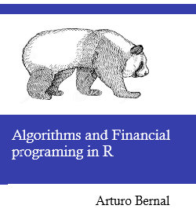

--- 
title: "Algorithms and Financial programing in R"
author: "Arturo Bernal"
date: "2022-07-16"
knit: "bookdown::render_book"
site: bookdown::bookdown_site
output: bookdown::bs4_book
documentclass: book
bibliography: [book.bib]
biblio-style: apalike
link-citations: true
links-as-notes: true
colorlinks: true
github-repo: abernal30/BookAFP 
cover-image: images/coverf.png
url: https://www.arturo-bernal.com/book
description: "A guide financial modeling in R"
---

# Algorithms and Financial programing in R {-}

This is the [website]() for *Algorithms and Financial programing in R*! Visit the [GitHub repository for this site](), find the book at [O'Reilly](), or [buy it on Amazon]().

This work by [Aturo Bernal]() is licensed under a <a rel="license" href="">Creative Commons Attribution-NonCommercial-ShareAlike 3.0 United States License</a>.

# Preface {-}

Pending

## Outline {-}

We start by introducing ....

